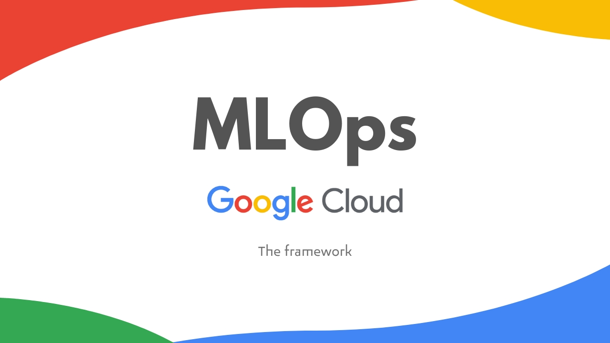
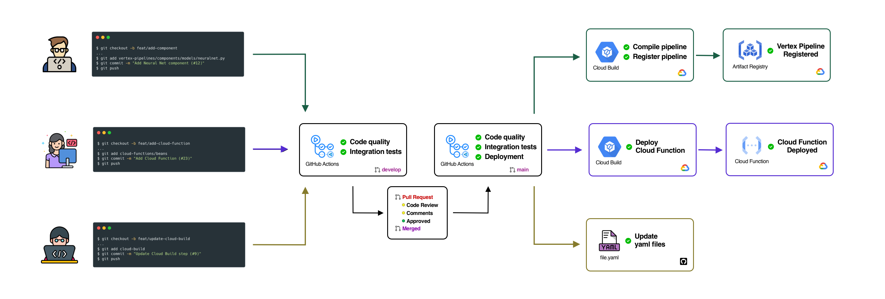
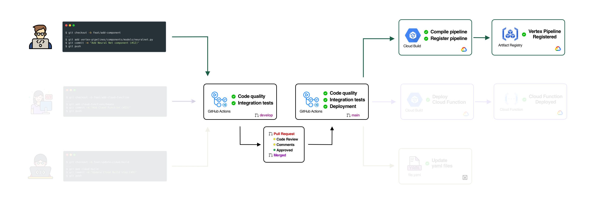
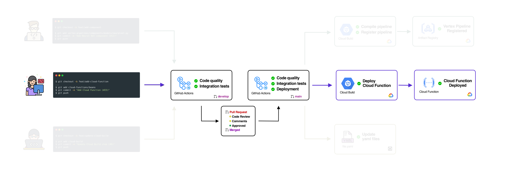
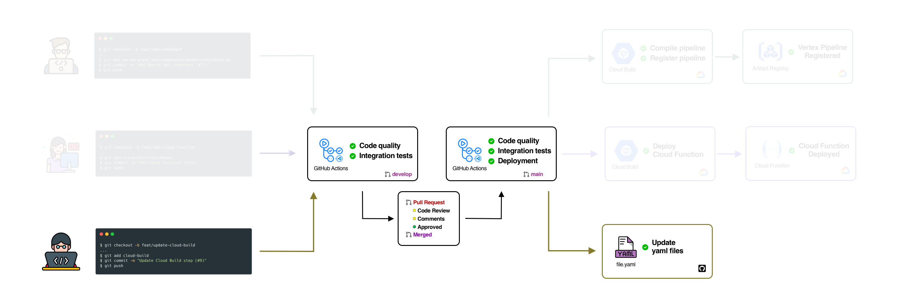

# MLOps on GCP

The purpose of this repository is to demonstrate the operation, collaboration, management, and functionality of components and services in a Machine Learning Operations (MLOps) ecosystem with Google Cloud Platform services.

Furthermore, this repository is intended to be used as a foundational framework for any type of organization that seeks to implement MLOps best practices under the Google Cloud ecosystem or any organization motivated to move to the next level of MLOps maturity [[ 1 ](https://cloud.google.com/architecture/mlops-continuous-delivery-and-automation-pipelines-in-machine-learning)].

We believe that this base template framework is replicable as a starting point for integration of components and services for the scalability of MLOps in various organizations.

1. [How to understand this repository?](#1-how-to-understand-this-repository)
    - 1.1 [Vertex Pipelines](#11-vertex-pipelines)
    - 1.2 [Cloud Functions](#12-cloud-functions)
    - 1.3 [Cloud Build & Github Actions](#13-cloud-build--github-actions)
3. [Repository organization](#2-repository-organization)
    - 2.1 [vertex-pipelines](#21-vertex-pipelines)
    - 2.2 [cloud-functions](#22-cloud-functions)
    - 2.3 [cloud-build](#23-cloud-build)
    - 2.4 [.github/workflows](#24-githubworkflows)
3. [Contributions](#3-contributions)

4. [References](#4-references)

## 1. How to understand this repository?

This repository implements (for now) 3 operational flows of integration, development and continuous deployment. In the following image we can see a representation of each of these flows and the components involved.

The Github Actions components are intended to carry out continuous integration as part of the deployment. On the other hand, Cloud Build components have the purpose of validating, registering and deploying Google Cloud components.

### 1.1 Vertex Pipelines

The first flow describes the process of updating `pipelines` and `components` within `vertex-pipelines` [[ 2 ](https://cloud.google.com/vertex-ai/docs/pipelines/introduction)]. When a collaborator submits a change, one of the Github Actions flows detects that the change has been within the `vertex-pipelines` directory and consequently triggers the flow corresponding to updating the component and registering the pipeline. The following figure represents the update flow of vertex-pipelines.

### 1.2 Cloud Functions
The second flow describes the process of updating some element within the `cloud-functions` [[ 3 ](https://cloud.google.com/functions/docs)] directory. When a collaborator submits a change, Github Actions detects if the change has occurred in `cloud-functions` and consequently triggers the flow corresponding to the registration and deployment of a Cloud Function. The following figure represents the mentioned flow.

### 1.3 Cloud Build & Github Actions

The third flow describes the flow to update Github Actions [[ 4 ](https://docs.github.com/en/actions)] CI/CD flows such as the verification, registration, and deployment flows defined in Cloud Build [[ 5 ](https://cloud.google.com/build/docs/overview)]. The following image shows the representation of the flow for updating the YAML files.

## 2. Repository organization

This repository follows a service-based structure, the objective of which is to manage in an organized way the elements that contribute to the service.

### 2.1 vertex-pipelines

The purpose of the `vertex-pipelines` directory is to organize **Vertex Pipelines** elements by:

- `components`: organized by `evaluators`, `models` and `utils`  (if required, more categories can be added, for example: `explainability`).
- `pipelines`: organized by *projects*, this repository contains two example *projects*: `beans` and `houses` .

The interaction between `components` and `pipelines` should be understood as:

> *"A pipeline is defined under a specific project where such pipeline is built based on components defined in components”*
>

### 2.2 cloud-functions

The purpose of the `cloud-functions` directory is to manage functions that will serve as **triggers** or **callers** of **Vertex Pipelines**.

- Cloud Functions are organized by *project*.
- Each *project* might be linked to a `pipeline` defined in `vertex-pipelines`. However, the Cloud Functions defined under  `cloud-functions` are not required to be tied to a specific `pipeline` in `vertex-pipelines`.

In this repository, we have two Cloud Functions, `beans` and `houses` that serve as callers of the pipelines `beans_pipeline.py` and `houses_pipeline.py` respectively.

### 2.3 cloud-build

Contains the Cloud Build definition for `vertex-pipelines` and `cloud-functions`. For Vertex Pipelines, the `cloud-build/vertex-pipeline.yaml` file contains the steps to **compile** and **register** a pipeline. For Cloud Functions, the `cloud-build/cloud-functions.yaml`file contains the steps to **deploy** a Cloud Function.

In this repository, everything under the `vertex-pipelines/` directory is considered by `cloud-build/vertex-pipeline.yaml`. Likewise, everything under `cloud-functions/` is considered by `cloud-build/cloud-functions.yaml`.

### 2.4 .github/workflows

Github Actions. This directory contains the definition for the Github Actions flow. In this case, two flows have been defined: `cicd-dev.yaml` and `cicd-prod.yaml`.

## 3. Contributions

Let's grow this MLOps framework together.

The steps to create your first contribution are:

- 1️⃣ Create an issue where you explain:
  - What is the objective of the feature? (In case of adding a new feature)
  - What is the bug to be solved? (In case of bugs)

- 2️⃣ Make a `Pull Request` to `develop`
  - Set `@ferneutron` or `@ulises-code` as the reviewers

- 3️⃣ Let's work together to make your PR merged!

## 4. References

- [ 1 ] [**MLOps: Continuous delivery and automation pipelines in machine learning**](https://cloud.google.com/architecture/mlops-continuous-delivery-and-automation-pipelines-in-machine-learning)
- [ 2 ] [**Introduction to Vertex AI Pipelines**](https://cloud.google.com/vertex-ai/docs/pipelines/introduction)]
- [ 3 ] [**Cloud Functions Documentation**](https://cloud.google.com/functions/docs)
- [ 4 ] [**GitHub Actions Documentation**](https://docs.github.com/en/actions)
- [ 5 ] [**Overview of Cloud Build**](https://cloud.google.com/build/docs/overview)
