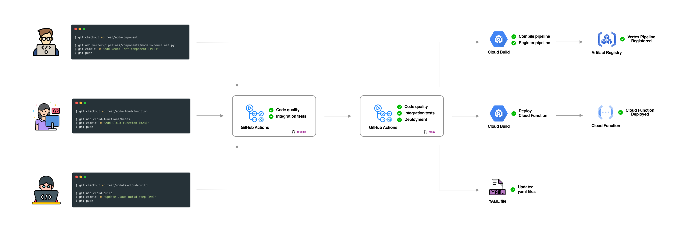

# MLOps on GCP

The purpose of this repository is to demonstrate the operation, collaboration, management, and functionality of components and services in a Machine Learning Operations (MLOps) ecosystem with Google Cloud Platform services.

Furthermore, this repository is intended to be used as a foundational framework for any type of organization that seeks to implement MLOps best practices under the Google Cloud ecosystem or any organization motivated to move to the next level of MLOps maturity [[ 1 ](https://cloud.google.com/architecture/mlops-continuous-delivery-and-automation-pipelines-in-machine-learning)].

1. [How to understand this repository?](#1-how-to-understand-this-repository)
2. [Repository organization](#2-repository-organization)
    1. [vertex-pipelines](#21-vertex-pipelines)
    2. [cloud-functions](#22-cloud-functions)
    3. [cloud-build](#23-cloud-build)
    4. [.github/workflows](#24-githubworkflows)
3. Adding a Vertex Pipeline Component
4. Adding a Cloud Function
5. Contributions
    1. (Video) how to clone the repo
    2. (Video) how to add a task
    3. (Video) how to submit your first PR
6. References
7. Scope

## 1. How to understand this repository?

In progress (almost ready)

## 2. Repository organization

This repository follows a service-based structure, the objective of which is to manage in an organized way the elements that contribute to the service.

### 2.1 vertex-pipelines

Contains the elements of **Vertex Pipelines** organized by `components` and `pipelines`.

`components` are organized by `evaluators`, `models` and `utils`  (if required, more categories can be added, for example: `explainability` ).

`pipelines` are organized by *projects*, this repository contains two example *projects*: `beans` and `houses` .

The interaction between `components` and `pipelines` should be understood as:

> *"a pipeline is defined under a specific project where such pipeline is built based on components defined in components”*
>

### 2.2 cloud-functions

The purpose of the `cloud-functions` directory is to manage functions that will serve as **triggers** or **callers** of `vertex-pipelines`.

Cloud Functions are organized by *project*. Each *project* might be linked to a `pipeline` defined in `vertex-pipelines` .  However, the Cloud Functions defined under  `cloud-functions` are not required to be tied to a specific `pipeline` in `vertex-pipelines`.

In this repository, we have two Cloud Functions, `beans` and `houses` that serve as callers of the pipelines `beans_pipeline.py` and `houses_pipeline.py` respectively.

### 2.3 cloud-build

Contains the Cloud Build definition for `vertex-pipelines` and `cloud-functions`. For Vertex Pipelines, the `cloud-build/vertex-pipeline.yaml` file contains the steps to **compile** and **register** a pipeline. For Cloud Functions, the `cloud-build/cloud-functions.yaml`file contains the steps to **deploy** a Cloud Function.

In this repository, everything under the `vertex-pipelines/` directory is considered by `cloud-build/vertex-pipeline.yaml`. Likewise, everything under `cloud-functions/` is considered by `cloud-build/cloud-functions.yaml`.

### 2.4 .github/workflows

Github Actions. This directory contains the definition for the Github Actions flow. In this case, two flows have been defined: `cicd-dev.yaml` and `cicd-prod.yaml`.

## 3. How to add a Vertex Pipeline

## 4. How to add a Cloud Function

## 4. Contributions

## 5. References

- [ 1 ] [**MLOps: Continuous delivery and automation pipelines in machine learning**](https://cloud.google.com/architecture/mlops-continuous-delivery-and-automation-pipelines-in-machine-learning)
